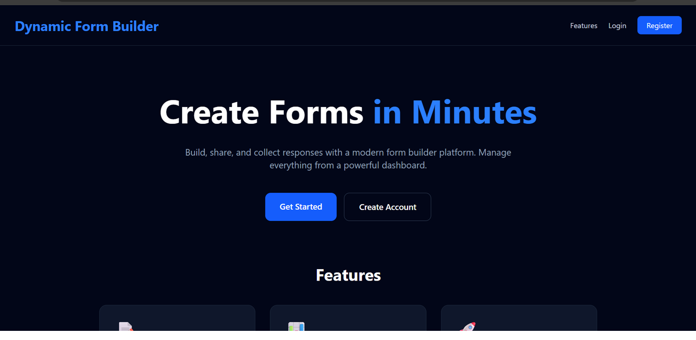
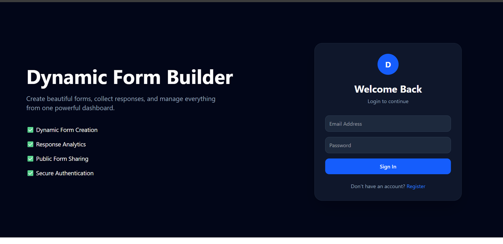
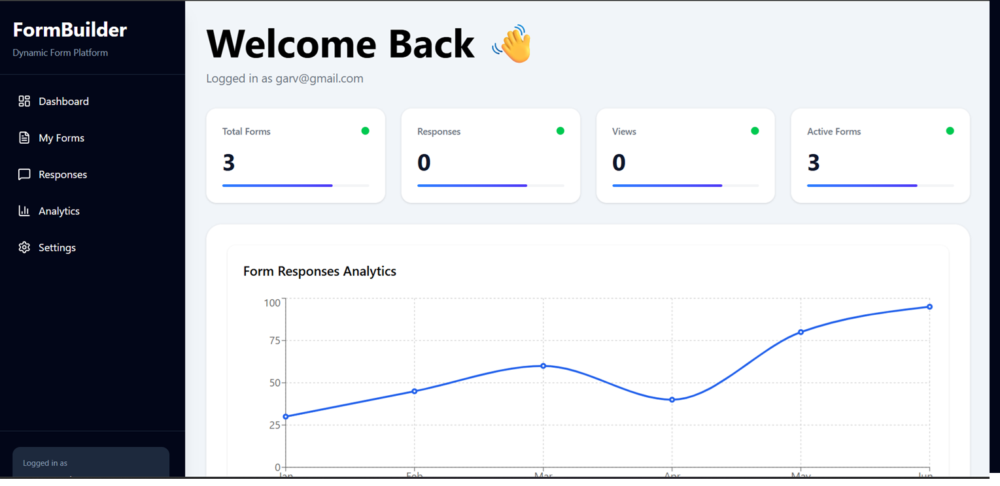
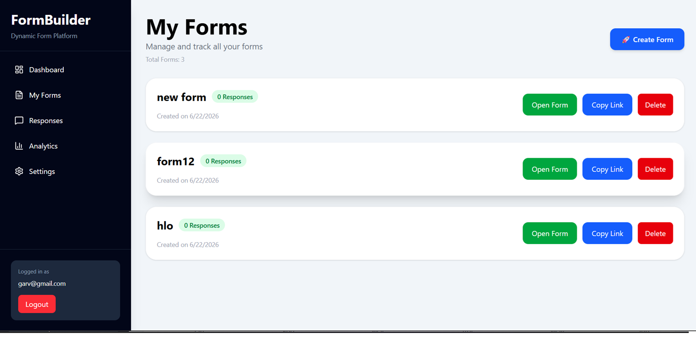

# Dynamic Form Builder

A full-stack form creation and response collection platform built with Next.js, TypeScript, Prisma, PostgreSQL, and NextAuth.

## 🚀 Live Demo

https://dynamic-form-builder-ruby.vercel.app

---

## ✨ Features

- User Authentication
- Dynamic Form Creation
- Public Form Sharing
- Response Collection
- Dashboard Analytics
- Form Management
- Responsive UI

---

## 🛠 Tech Stack

### Frontend
- Next.js
- TypeScript
- Tailwind CSS

### Backend
- Next.js API Routes
- Prisma ORM

### Database
- PostgreSQL

### Authentication
- NextAuth.js

### Deployment
- Vercel

---

## 📸 Screenshots

### Landing Page


### Login Page


### Dashboard


### Form Builder


### Analytics Dashboard


---

## ⚙️ Installation

Clone the repository:

```bash
git clone https://github.com/YOUR_USERNAME/dynamic-form-builder.git
```

Install dependencies:

```bash
npm install
```

Create `.env` file:

```env
DATABASE_URL=your_database_url
AUTH_SECRET=your_secret
AUTH_URL=http://localhost:3000
```

Run the project:

```bash
npm run dev
```

---

## 👨‍💻 Author

Garv Arora